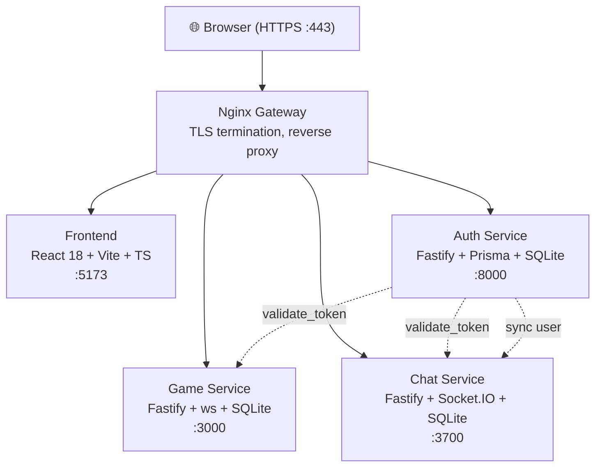

# 📋 ft_transcendence — Full Project Report

> **Date:** March 10, 2026  
> **Scope:** Architecture, subject compliance, security audit, bugs, and recommendations

---

## 1. Architecture Overview

| Layer | Technology | Notes |
|-------|-----------|-------|
| **Frontend** | React 18, TypeScript, Vite, ShadCN/Radix | SPA behind Nginx |
| **Auth Service** | Fastify, Prisma ORM, bcrypt, JWT | TypeScript |
| **Game Service** | Fastify, native `ws` WebSocket, raw SQLite | JavaScript, 60fps game loop |
| **Chat Service** | Fastify, Socket.IO, raw SQLite, `xss` sanitizer | JavaScript |
| **Gateway** | Nginx (stable-alpine) | TLS, routing, HSTS |
| **Orchestration** | Docker Compose | Bridge network |
| **Database** | SQLite (3 separate DB files) | One per service |

---

## 2. Subject Module Compliance

The subject requires **7 Major modules** (Minor counts as 0.5). Current status:

| # | Module | Type | Status | Notes |
|---|--------|------|--------|-------|
| 1 | Backend Framework (Fastify) | **Major** | ✅ Done | All 3 services use Fastify |
| 2 | Frontend Toolkit (TypeScript) | Minor | ✅ Done | React + TS |
| 3 | Database (SQLite) | Minor | ✅ Done | 3 separate SQLite DBs |
| 4 | Standard User Management | **Major** | ⚠️ Bugs | Profile updates, avatars — has critical bugs |
| 5 | Remote Auth (GitHub OAuth) | **Major** | ⚠️ Bugs | OAuth flow has critical token handling bugs |
| 6 | Remote Players (Online Pong) | **Major** | ✅ Done | 1v1, 2v2, server-authoritative |
| 7 | AI Opponent | **Major** | ✅ Done | Physics-prediction, difficulty tiers, 1s refresh |
| 8 | Stats Dashboards | Minor | ✅ Done | Wins, losses, win rate, tournaments |
| 9 | Live Chat | **Major** | ⚠️ Bugs | Socket.IO, DMs, block, friends, invites |
| 10 | 2FA & JWT | **Major** | ❌ **2FA MISSING** | JWT ✅ — TOTP/2FA not implemented |
| 11 | Microservices Backend | **Major** | ✅ Done | 3 independent services |

### Scoring

| Count | Value | Total |
|-------|-------|-------|
| 6 Major modules complete | ×1 | 6.0 |
| 2 Minor modules complete | ×0.5 | 1.0 |
| | **Total** | **7.0** |

> [!CAUTION]
> The 7.0 total **only holds if 2FA is NOT required** as part of the "2FA & JWT" module. If the subject treats them as one combined module, **you are at 6.0** and need 2FA to pass. The [things-to-fix.md](file:///home/resh/Desktop/ft_transcendence/things-to-fix.md) in your repo also flags this.

---

## 3. 🔴 Security Threats & Vulnerabilities

### 3.1 CRITICAL Severity

| # | Threat | Location | Impact | OWASP Category |
|---|--------|----------|--------|----------------|
| **S1** | **Hardcoded secrets committed to Git** | [.env](file:///home/resh/Desktop/ft_transcendence/services/.env) — `JWT_ACCESS_SECRET`, `COOKIE_SECRET` in plaintext | Full session hijacking if repo is public | A07:2021 - Security Misconfiguration |
| **S2** | **TLS certificate verification disabled** | `NODE_TLS_REJECT_UNAUTHORIZED=0` in [docker-compose.yml](file:///home/resh/Desktop/ft_transcendence/docker-compose.yml) L54, L84 | Man-in-the-middle attacks between services | A07:2021 |
| **S3** | **Single JWT secret for both access & refresh tokens** | [app.ts](file:///home/resh/Desktop/ft_transcendence/services/auth-service/src/app.ts) L28 — only `JWT_ACCESS_SECRET` registered | If access token secret leaks, attacker can forge refresh tokens too | A02:2021 - Cryptographic Failures |
| **S4** | **`/validate_token` endpoint has no authentication** | [user.route.ts](file:///home/resh/Desktop/ft_transcendence/services/auth-service/src/modules/user/user.route.ts) L277-308 | Anyone can test if arbitrary tokens are valid (oracle attack) | A01:2021 - Broken Access Control |
| **S5** | **`/update_email` has no `preHandler: authenticate`** | [user.route.ts](file:///home/resh/Desktop/ft_transcendence/services/auth-service/src/modules/user/user.route.ts) L122-143 | Manually verifies token in controller — inconsistent auth, potential bypass | A01:2021 |
| **S6** | **`/get-user/:userId` endpoint has no authentication** | [user.route.ts](file:///home/resh/Desktop/ft_transcendence/services/auth-service/src/modules/user/user.route.ts) L7-30 | Anyone can enumerate user IDs and names | A01:2021 |
| **S7** | **`/sync-email` on game-service has no auth** | Game service [server.js](file:///home/resh/Desktop/ft_transcendence/services/game-service/server.js) — called by auth without any auth header | Attacker can change any user's email in game DB | A01:2021 |

### 3.2 HIGH Severity

| # | Threat | Location | Impact |
|---|--------|----------|--------|
| **S8** | **No rate limiting** on `/login`, `/register`, `/refresh` | All auth endpoints | Brute-force password attacks, credential stuffing |
| **S9** | **No CSRF protection** | All state-changing endpoints | Cross-site request forgery on cookie-based auth |
| **S10** | **No CSP (Content-Security-Policy) headers** | [nginx.conf](file:///home/resh/Desktop/ft_transcendence/services/gateway/nginx.conf) | XSS payloads have no browser-level defense |
| **S11** | **No WebSocket message validation** | [server.js](file:///home/resh/Desktop/ft_transcendence/services/game-service/server.js) L842-904 — `JSON.parse` with no schema | Malformed/malicious messages could crash game service or inject data |
| **S12** | **CORS allows all origins** | Auth: `origin: true`, Chat: [(origin, cb) => cb(null, true)](file:///home/resh/Desktop/ft_transcendence/services/game-service/server.js#158-197) | Any website can make authenticated API calls |
| **S13** | **Chat Socket.IO authenticates with refresh_token** | [server.js](file:///home/resh/Desktop/ft_transcendence/services/chat-service/server.js) L376-381 | Refresh token (long-lived, 7d) is sent to validate_token which expects access tokens — confuses token types |
| **S14** | **`console.log` leaks tokens/user data** | Multiple files | Sensitive data in container logs |
| **S15** | **Weak password policy** | Only 6-char minimum, no complexity | Easy to brute-force |
| **S16** | **`SameSite: "none"` on refresh cookie in production** | [user.controller.ts](file:///home/resh/Desktop/ft_transcendence/services/auth-service/src/modules/user/user.controller.ts) L119 | Cookie sent on cross-site requests, enabling CSRF |

### 3.3 MEDIUM Severity

| # | Threat | Location | Impact |
|---|--------|----------|--------|
| **S17** | **No image upload validation** | [update_image](file:///home/resh/Desktop/ft_transcendence/services/auth-service/src/modules/user/user.controller.ts#514-587) in [user.controller.ts](file:///home/resh/Desktop/ft_transcendence/services/auth-service/src/modules/user/user.controller.ts) L514 | No size limit enforcement server-side, no MIME validation; could store malicious payloads |
| **S18** | **Error details leaked to client** | [createUser](file:///home/resh/Desktop/ft_transcendence/services/auth-service/src/modules/user/user.controller.ts#10-80) returns raw error on 500: `reply.code(500).send(e)` L77 | Stack traces and DB errors exposed |
| **S19** | **No account lockout** | Login endpoint | Unlimited password attempts |
| **S20** | **`/users/add` blocked at gateway but accessible internally** | [nginx.conf](file:///home/resh/Desktop/ft_transcendence/services/gateway/nginx.conf) L71-73 blocks it, but service-to-service calls bypass nginx | Internal endpoint security relies on network isolation only |
| **S21** | **Game service port exposed** | [docker-compose.yml](file:///home/resh/Desktop/ft_transcendence/docker-compose.yml) L86 — `ports: "3000:3000"` | Game service directly accessible, bypassing nginx auth |
| **S22** | **Matchmaking race condition** | `getOpenRoom` + `updateMatch` not atomic in [server.js](file:///home/resh/Desktop/ft_transcendence/services/game-service/server.js) | Two players could overwrite each other's slot |

### 3.4 LOW Severity

| # | Threat | Location | Impact |
|---|--------|----------|--------|
| **S23** | **Self-signed certificates** | [generate-certs.sh](file:///home/resh/Desktop/ft_transcendence/scripts/generate-certs.sh) | Browser warnings, no CA trust chain (acceptable for 42 project) |
| **S24** | **No request body size limit** | Fastify default is ~1MB but not explicitly configured | Potential DoS via large payloads |
| **S25** | **`INTERNAL_SERVICE_KEY` set to `change-me-in-dev`** | [.env](file:///home/resh/Desktop/ft_transcendence/services/.env) L10 | Weak internal auth key |
| **S26** | **Frontend runs in dev mode in Docker** | Volume mounts source + `npm run dev` | Not production-optimized, debug info exposed |

---

## 4. 🐛 Known Bugs (from code analysis)

### Critical Bugs

| Bug | File | Description |
|-----|------|-------------|
| **React hooks violation** | `GameOnline.tsx`, `TournamentOnline.tsx` | `useEffect` called inside conditional returns — violates Rules of Hooks |
| **`validate_token` null crash** | [user.route.ts](file:///home/resh/Desktop/ft_transcendence/services/auth-service/src/modules/user/user.route.ts) L298 | `current_user.name` crashes if user deleted but token valid |
| **Game service ID type mismatch** | Game SQL uses `INTEGER` for IDs but auth generates CUID strings | Queries may silently fail or match wrong records |
| **Zod schema mismatch** | [user.schema.ts](file:///home/resh/Desktop/ft_transcendence/services/auth-service/src/modules/user/user.schema.ts) L32-35 | `updatePassSchema` has `new_email` + [password](file:///home/resh/Desktop/ft_transcendence/services/auth-service/src/modules/user/user.controller.ts#242-293) instead of `current_password` + `new_password` |

### Functional Bugs

| Bug | Details |
|-----|---------|
| **Tournament state lost on restart** | In-memory only (`new Map()`) — server crash = all tournaments gone |
| **Password change clears wrong cookie** | [user.controller.ts](file:///home/resh/Desktop/ft_transcendence/services/auth-service/src/modules/user/user.controller.ts) L280 clears `access_token` cookie, but tokens are now in memory |
| **PongCanvas stale closure** | `requestAnimationFrame` captures old `gameState` — visual glitches |
| **Duplicate event listeners** | PongCanvas components register same listeners twice |
| **[getUserName](file:///home/resh/Desktop/ft_transcendence/services/game-service/server.js#813-840) is called per tick per match** | N+1 query problem in game loop if names aren't cached |

---

## 5. ❌ Missing Features

| Feature | Priority | Notes |
|---------|----------|-------|
| **2FA (TOTP)** | 🔴 Critical | Required to complete the "2FA & JWT" major module |
| **AI difficulty selector UI** | 🟡 Medium | AI defaults to HARD; no frontend toggle |
| **Other users' profiles** | 🟡 Medium | Dashboard only shows own stats |
| **Friend online status display** | 🟡 Medium | Backend tracks it but frontend incomplete |
| **Chat message pagination** | 🟢 Low | All messages loaded at once |
| **Responsive game canvas** | 🟢 Low | Fixed 800×600, breaks on small screens |

---

## 6. DevOps Issues

| Issue | Impact |
|-------|--------|
| No health checks on any container | Docker can't detect and restart crashed services |
| No `depends_on` for chat-service | May start before auth-service is ready |
| Frontend uses dev server in production Docker | Not optimized, slower loads, debug tools exposed |
| `JWT_ACCESS_SECRET` duplicated across env files | Risk of mismatch between services |
| [.env](file:///home/resh/Desktop/ft_transcendence/frontend/.env) files not in [.gitignore](file:///home/resh/Desktop/ft_transcendence/frontend/.gitignore) | Secrets committed to version control |

---

## 7. What Works Well ✅

| Area | Assessment |
|------|------------|
| **JWT auth flow** | Access in memory + refresh in httpOnly cookie is modern best practice |
| **Refresh token rotation** | Old refresh tokens invalidated — limits replay attacks |
| **Server-authoritative game** | Client only sends key inputs — anti-cheat by design |
| **AI implementation** | Physics prediction with noise, 1s refresh, simulates keyboard — compliant with subject |
| **Microservices separation** | Clean boundary between auth, game, chat |
| **Chat XSS protection** | Uses `xss` library to sanitize messages |
| **Cross-service user sync** | Email/username changes propagate to other services |
| **bcrypt password hashing** | 10 salt rounds, industry standard |
| **HSTS enabled** | Forces HTTPS in nginx |

---

## 8. Recommended Priority Actions

### Must-fix before evaluation

1. **Implement 2FA** — Without it, the "2FA & JWT" major module is incomplete
2. **Fix `validate_token` null crash** — Will cause 500 errors during evaluation
3. **Fix Zod schema for `updatePassSchema`** — Schema doesn't match controller
4. **Remove hardcoded secrets from [.env](file:///home/resh/Desktop/ft_transcendence/frontend/.env)** — Use [generate-jwt-secrets.sh](file:///home/resh/Desktop/ft_transcendence/scripts/generate-jwt-secrets.sh) and [.gitignore](file:///home/resh/Desktop/ft_transcendence/frontend/.gitignore)
5. **Fix hooks violation** in `GameOnline.tsx` / `TournamentOnline.tsx` — Build may fail

### Should-fix (evaluation polish)

6. Add rate limiting to login/register (even basic `fastify-rate-limit`)
7. Remove `console.log` statements that leak tokens
8. Add `preHandler: authenticate` to `/update_email` route
9. Add input validation to WebSocket messages
10. Fix password change to clear `refresh_token` cookie instead of `access_token`

### Nice-to-have

11. Add CSP headers to nginx
12. Add Docker health checks
13. Build frontend in production mode
14. Add CSRF protection
15. Remove exposed game-service port from docker-compose
