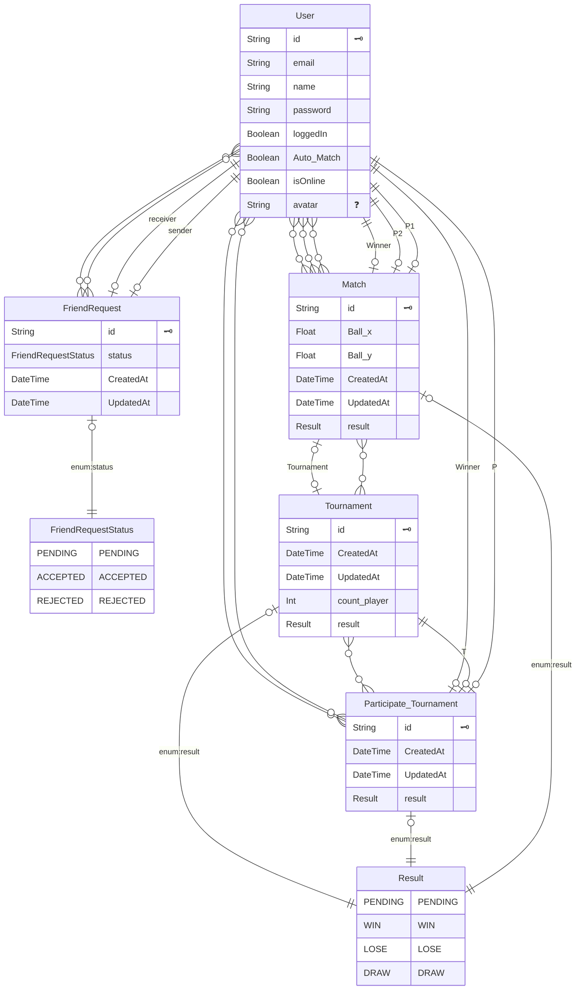

```mermaid
erDiagram

        FriendRequestStatus {
            PENDING PENDING
ACCEPTED ACCEPTED
REJECTED REJECTED
        }
    


        Result {
            PENDING PENDING
WIN WIN
LOSE LOSE
DRAW DRAW
        }
    
  "User" {
    String id "🗝️"
    String email 
    String name 
    String password 
    Boolean loggedIn 
    Boolean Auto_Match 
    Boolean isOnline 
    String avatar "❓"
    }
  

  "FriendRequest" {
    String id "🗝️"
    FriendRequestStatus status 
    DateTime CreatedAt 
    DateTime UpdatedAt 
    }
  

  "Tournament" {
    String id "🗝️"
    DateTime CreatedAt 
    DateTime UpdatedAt 
    Int count_player 
    Result result 
    }
  

  "Participate_Tournament" {
    String id "🗝️"
    DateTime CreatedAt 
    DateTime UpdatedAt 
    Result result 
    }
  

  "Match" {
    String id "🗝️"
    Float Ball_x 
    Float Ball_y 
    DateTime CreatedAt 
    DateTime UpdatedAt 
    Result result 
    }
  
    "User" o{--}o "FriendRequest" : ""
    "User" o{--}o "FriendRequest" : ""
    "User" o{--}o "Match" : ""
    "User" o{--}o "Match" : ""
    "User" o{--}o "Match" : ""
    "User" o{--}o "Participate_Tournament" : ""
    "User" o{--}o "Participate_Tournament" : ""
    "FriendRequest" o|--|| "FriendRequestStatus" : "enum:status"
    "FriendRequest" o|--|| "User" : "receiver"
    "FriendRequest" o|--|| "User" : "sender"
    "Tournament" o|--|| "Result" : "enum:result"
    "Tournament" o{--}o "Match" : ""
    "Tournament" o{--}o "Participate_Tournament" : ""
    "Participate_Tournament" o|--|| "Result" : "enum:result"
    "Participate_Tournament" o|--|| "User" : "Winner"
    "Participate_Tournament" o|--|| "Tournament" : "T"
    "Participate_Tournament" o|--|| "User" : "P"
    "Match" o|--|| "Result" : "enum:result"
    "Match" o|--|o "Tournament" : "Tournament"
    "Match" o|--|| "User" : "Winner"
    "Match" o|--|| "User" : "P2"
    "Match" o|--|| "User" : "P1"
```
